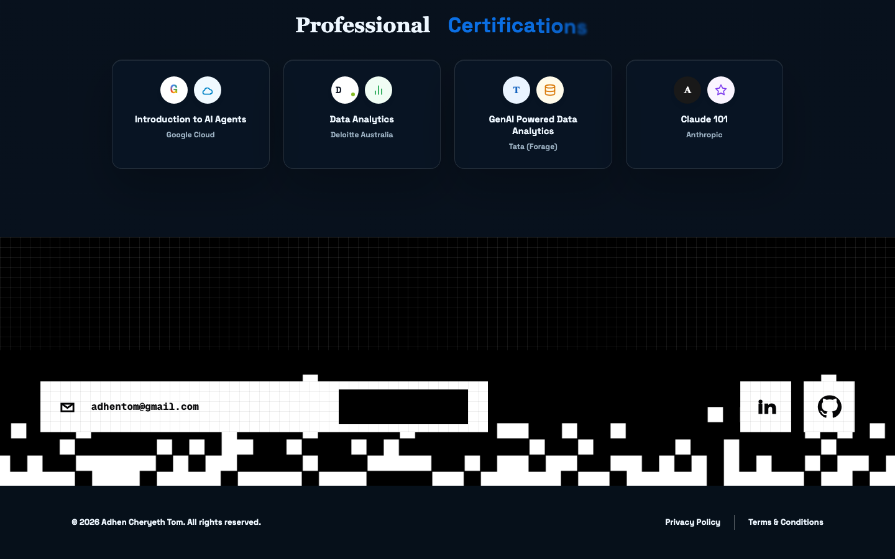
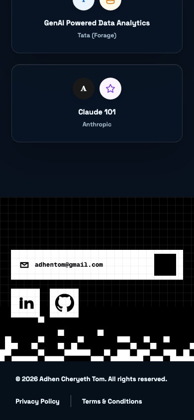

# Adhen Portfolio

Personal portfolio website for **Adhen Cheryeth Tom**, built with Next.js, React, Tailwind CSS, custom visual assets, and lightweight interactive motion.



## Overview

This portfolio presents Adhen's work across AI, software engineering, backend systems, dashboards, and community leadership. It is designed as a polished, visual-first single-page experience with project highlights, technology stack cards, certifications, achievements, contact links, legal pages, and a custom 404 page.

## Preview

| Desktop | Mobile |
| --- | --- |
|  |  |

## Features

- Responsive portfolio landing page with hero, about, stack, work, achievements, and contact sections.
- Light and dark theme support with persisted preference.
- Animated icon system with stable fallbacks.
- Project showcase with tabbed project details.
- Custom portfolio artwork, logo assets, and visual cards.
- Privacy, terms, and not-found pages.
- Next.js App Router project structure.
- Webpack-backed dev script for reliable local development with this Next.js 16 setup.

## Tech Stack

- **Framework:** Next.js 16
- **UI:** React 19, Tailwind CSS 4
- **Motion and icons:** Lottie Web, Lucide React
- **Language:** TypeScript
- **Tooling:** ESLint, npm

## Getting Started

Install dependencies:

```bash
npm install
```

Run the development server:

```bash
npm run dev
```

Open the app:

```text
http://localhost:3001
```

Next.js will use `3000` when available. If `3000` is already occupied, it will select the next available port, such as `3001`.

## Scripts

```bash
npm run dev
```

Starts the local development server using webpack.

```bash
npm run build
```

Creates a production build.

```bash
npm run start
```

Starts the production server after a successful build.

```bash
npm run lint
```

Runs ESLint across the project.

## Project Structure

```text
src/app/
  page.tsx               Main portfolio page
  layout.tsx             Root layout, fonts, metadata, theme bootstrap
  portfolio-content.ts   Portfolio copy and structured content
  portfolio-icons.tsx    Supporting icon/logo components
  pro-ui.css             Main visual system and responsive styles
  privacy/page.tsx       Privacy page
  terms/page.tsx         Terms page
  not-found.tsx          Custom 404 page

src/components/ui/
  animated-icon.tsx      Lottie icon wrapper with Lucide fallback
  encrypted-text.tsx     Contact text reveal effect
  flip-words.tsx         Rotating word treatment
  theme-toggle.tsx       Light/dark theme control

public/assets/
  portfolio/             Brand, portrait, card, and preview assets
  wired-icons/           Lottie animation JSON files
```

## Validation

The latest local validation passed:

```bash
npm run lint
npm run build
```

The rendered app was also checked in browser for:

- clean page load
- no Next.js error overlay
- no relevant console errors
- working light/dark toggle
- working same-page navigation
- desktop and mobile layout sanity

## Repository

GitHub: [adhentom/Adhen-Portfolio](https://github.com/adhentom/Adhen-Portfolio)

## Author

**Adhen Cheryeth Tom**

- Email: [adhentom@gmail.com](mailto:adhentom@gmail.com)
- GitHub: [adhentom](https://github.com/adhentom)
- LinkedIn: [adhen-cheryeth-tom](https://linkedin.com/in/adhen-cheryeth-tom)
